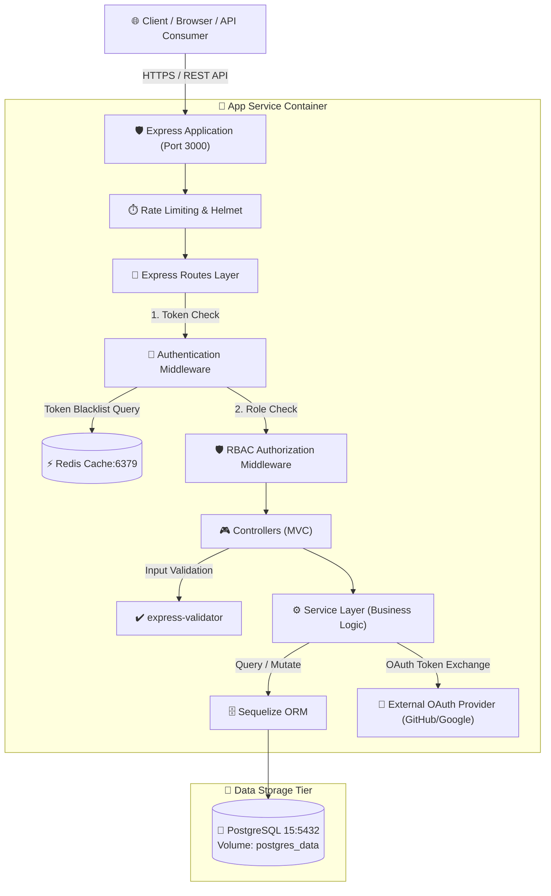
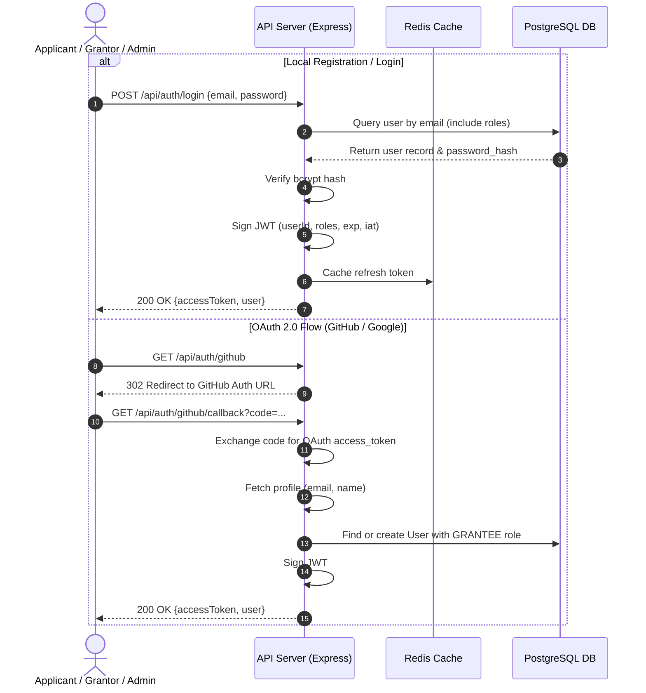
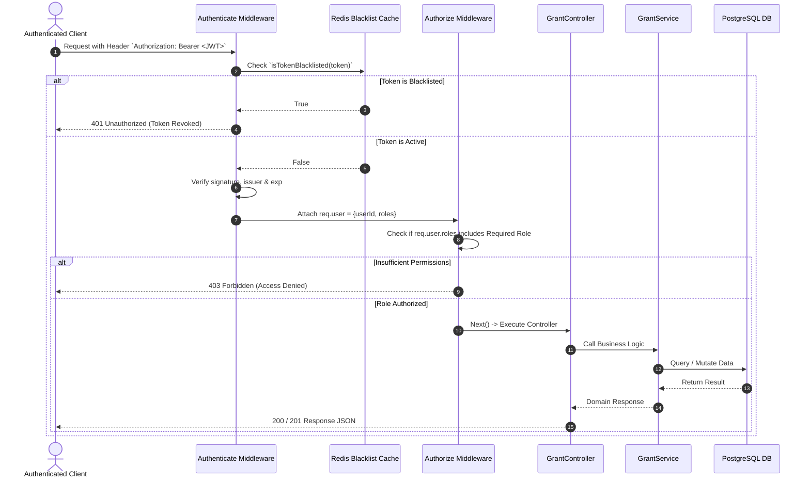
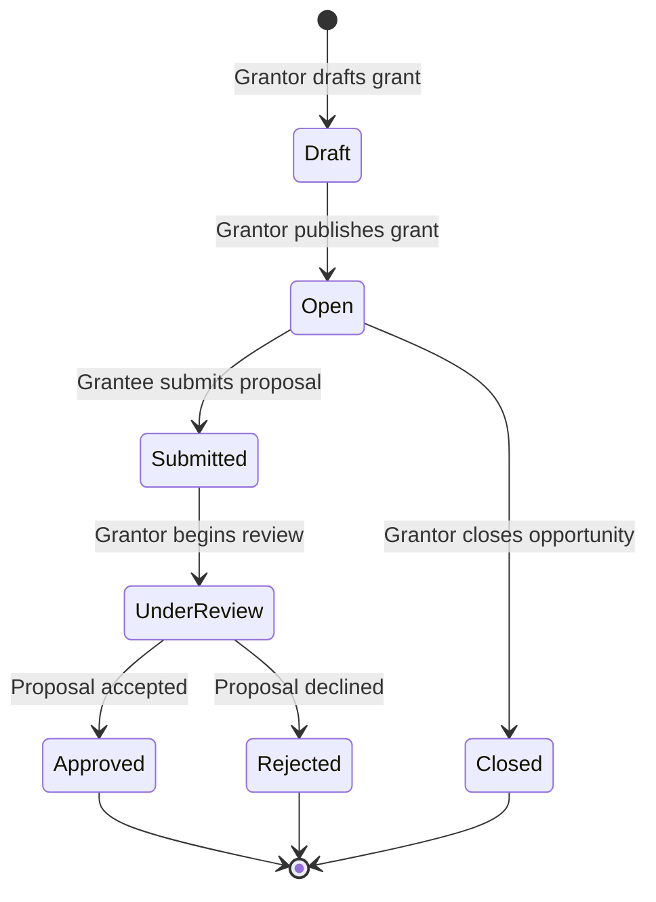

<div align="center">

# 🏛️ Secure Grant Management Portal
### Enterprise-Grade Grant Distribution Platform with RBAC & OAuth 2.0

[](https://nodejs.org/)
[](https://expressjs.com/)
[](https://www.postgresql.org/)
[](https://redis.io/)
[](https://www.docker.com/)
[](https://jwt.io/)
[](https://jestjs.io/)
[](#testing-and-code-coverage)

<p align="center">
  <b>A production-ready, containerized backend system implementing Role-Based Access Control (RBAC), multi-provider OAuth 2.0 authentication, Redis token invalidation, and relational data integrity using the Model-View-Controller (MVC) architecture.</b>
</p>

[Quick Start](#-quick-start) • [Architecture](#-system-architecture) • [Workflows & Diagrams](#-execution-flow-diagrams) • [API Contracts](#-api-endpoints--contracts) • [Testing](#-testing-and-code-coverage) • [Project Docs](projectdocumentation.md) • [Architecture Guide](architecture.md)

---

</div>

## 📌 Project Overview

The **Secure Grant Management Portal** solves the critical challenge of managing multi-stakeholder grant opportunities, submissions, and evaluations. Organizations offering funding (**GRANTORS**) can publish opportunities and review submissions, applicants (**GRANTEES**) can discover and apply with detailed proposals, and system administrators (**ADMINS**) govern user authorizations and role delegations.

### 🌟 Key Highlights
- **🔒 Granular RBAC Engine**: Strict role authorization (`ADMIN`, `GRANTOR`, `GRANTEE`) enforced via middleware layers.
- **🌐 Dual Authentication**: Native email/password authentication with `bcrypt` (12 rounds) alongside **OAuth 2.0 Authorization Code Flow** (GitHub & Google).
- **⚡ Redis-Powered Session Security**: Real-time token revocation and blacklist verification on every authenticated call.
- **🏗️ Pure MVC + Service Layer Architecture**: Clean separation of database schemas (Models), route input sanitization (Controllers), and business domain rules (Services).
- **🐳 1-Command Containerization**: Docker Compose orchestration of application, PostgreSQL database, and Redis cache with container health checks and dependencies.
- **🧪 100% Passing Test Suite**: End-to-end integration and unit tests providing **77.96% statement coverage**.

---

## 🛠️ Tech Stack & Dependencies

```
┌────────────────────────────────────────────────────────────────────────┐
│                          SYSTEM TECH STACK                             │
├───────────────────┬────────────────────────────────────────────────────┤
│ Runtime Engine    │ Node.js v18 LTS (Alpine-optimized container)       │
│ Web Framework     │ Express.js v4.18 with Helmet, CORS & Compression   │
│ Persistence Layer │ PostgreSQL 15 with Sequelize ORM 6.35              │
│ Cache & Session   │ Redis 7 Alpine with ioredis driver                 │
│ Security & Auth   │ JSON Web Tokens (jsonwebtoken), bcryptjs, OAuth 2.0│
│ Input Validation  │ express-validator v7                               │
│ Test Suite        │ Jest v29 + Supertest v6                            │
│ Orchestration     │ Docker Engine 24+ & Docker Compose v3.9            │
└───────────────────┴────────────────────────────────────────────────────┘
```

---

## 🏛️ System Architecture



---

## 🔄 Execution Flow Diagrams

### 1. User Authentication & JWT Issuance Flow



---

### 2. RBAC Protected Route Execution Flow



---

### 3. Grant & Application Lifecycle Flow



---

## 📂 Project Structure

```
secure-grant-management-portal/
├── .env.example                  # Environment template with placeholder values
├── .gitignore                    # Git exclusion rules (node_modules, logs, coverage)
├── Dockerfile                    # Multi-stage production container build
├── docker-compose.yml            # Complete app, db, and cache orchestration
├── package.json                  # Dependencies, test thresholds, and npm scripts
├── PROJECT_PLAN.md               # Agile User Stories & Acceptance Criteria
├── README.md                     # Visual documentation and getting-started guide
├── architecture.md               # In-depth Architectural Specification
├── projectdocumentation.md       # Comprehensive System & Module Documentation
│
├── src/
│   ├── app.js                    # Express app configuration & security middlewares
│   ├── server.js                 # Server entry point with graceful shutdown
│   │
│   ├── db/
│   │   ├── database.js           # Sequelize connection & connection pool
│   │   ├── init.sql              # PostgreSQL DDL & bootstrap seed script
│   │   └── seed.js               # Programmatic database seed utility
│   │
│   ├── models/                   # ORM Domain Models (Model in MVC)
│   │   ├── index.js              # Association mappings
│   │   ├── User.js               # User accounts & bcrypt logic
│   │   ├── Role.js               # Role definitions (ADMIN, GRANTOR, GRANTEE)
│   │   ├── UserRole.js           # Many-to-Many pivot model
│   │   ├── Grant.js              # Funding opportunities
│   │   └── Application.js        # Grant proposals & review status
│   │
│   ├── services/                 # Business Logic Domain (Model in MVC)
│   │   ├── AuthService.js        # Auth, JWT signing, OAuth 2.0 flows
│   │   ├── UserService.js        # Admin user & role management
│   │   ├── GrantService.js       # Grant CRUD & ownership verification
│   │   └── ApplicationService.js # Application submission & evaluations
│   │
│   ├── controllers/              # Request Handlers (Controller in MVC)
│   │   ├── AuthController.js
│   │   ├── UserController.js
│   │   ├── GrantController.js
│   │   └── ApplicationController.js
│   │
│   ├── routes/                   # Route Endpoints
│   │   ├── auth.js
│   │   ├── users.js
│   │   ├── grants.js
│   │   └── applications.js
│   │
│   ├── middleware/               # Security & Filter Middlewares
│   │   ├── auth.js               # authenticate() and authorize() RBAC checks
│   │   └── errorHandler.js       # Global error formatting & validation results
│   │
│   └── utils/                    # Shared Utilities
│       ├── ApiError.js           # Custom operational HTTP errors
│       ├── jwt.js                # JWT sign, verify, and decode helpers
│       ├── logger.js             # Winston structured logging
│       └── redis.js              # Redis client, caching, and blacklisting
│
└── tests/
    ├── setup.js                  # Global Jest environment & in-memory mocks
    ├── helpers.js                # Mock data factories & token generators
    ├── unit/                     # Isolated service, middleware & util tests
    │   ├── apiError.test.js
    │   ├── applicationService.test.js
    │   ├── auth.middleware.test.js
    │   ├── authService.test.js
    │   ├── grantService.test.js
    │   ├── jwt.test.js
    │   └── userService.test.js
    └── integration/              # Supertest HTTP contract & RBAC tests
        ├── applications.test.js
        ├── auth.test.js
        ├── general.test.js
        ├── grants.test.js
        └── users.test.js
```

---

## ⚡ Quick Start

### Prerequisites
- [Docker Engine](https://docs.docker.com/engine/install/) (v20.10+)
- [Docker Compose](https://docs.docker.com/compose/install/) (v2.0+)

### 1. Clone the Repository
```bash
git clone https://github.com/ramalokeshreddyp/secure-grant-management-portal.git
cd secure-grant-management-portal
```

### 2. Configure Environment Variables
```bash
cp .env.example .env
```
*(Default settings inside `.env.example` are preconfigured to run out-of-the-box in Docker).*

### 3. Start All Services with Docker Compose
```bash
docker-compose up --build
```

Docker Compose will automatically:
1. Initialize the PostgreSQL 15 container with persistent volume storage.
2. Execute [`src/db/init.sql`](file:///c:/Users/lokes/Desktop/Gpp-41/src/db/init.sql) to create tables and seed default roles and the initial Administrator.
3. Start Redis 7 for token blacklisting.
4. Launch the Express.js API container once database & cache health checks pass.

---

## 🔐 Default Seed Credentials

| Role | Email | Password | Permissions |
|------|-------|----------|-------------|
| **ADMIN** | `admin@grantportal.com` | `Admin@123456` | Full user administration & role assignments |
| **GRANTOR** | *(Assigned by Admin)* | Configured on signup | Create, update, delete own grants & review applications |
| **GRANTEE** | Auto-assigned on signup | Configured on signup | Browse open grants & submit proposals |

---

## 📡 API Endpoints & Contracts

### 🔑 Authentication (`/api/auth`)
| Method | Endpoint | Access | Description |
|--------|----------|--------|-------------|
| `POST` | `/api/auth/register` | Public | Register new account (`GRANTEE` role assigned) |
| `POST` | `/api/auth/login` | Public | Authenticate with email/password; returns JWT |
| `GET` | `/api/auth/github` | Public | Redirects to GitHub OAuth 2.0 authorization |
| `GET` | `/api/auth/github/callback` | Public | Handles OAuth callback & exchanges code for JWT |
| `GET` | `/api/auth/google` | Public | Redirects to Google OAuth 2.0 authorization |
| `GET` | `/api/auth/google/callback` | Public | Handles Google OAuth callback |
| `POST` | `/api/auth/logout` | Authenticated | Blacklists current JWT in Redis |
| `GET` | `/api/auth/me` | Authenticated | Retrieves current user profile and active roles |

### 👥 User Administration (`/api/users`)
| Method | Endpoint | Access | Description |
|--------|----------|--------|-------------|
| `GET` | `/api/users` | `ADMIN` | List all registered users with their roles |
| `GET` | `/api/users/:userId` | `ADMIN` | Get single user details |
| `POST` | `/api/users/:userId/roles` | `ADMIN` | Assign role (`GRANTOR`, `ADMIN`, `GRANTEE`) |
| `DELETE` | `/api/users/:userId/roles/:roleName`| `ADMIN` | Remove specific role from user |
| `PATCH` | `/api/users/:userId/deactivate` | `ADMIN` | Deactivate user account |

### 💰 Grant Management (`/api/grants`)
| Method | Endpoint | Access | Description |
|--------|----------|--------|-------------|
| `POST` | `/api/grants` | `GRANTOR` | Create a new grant opportunity |
| `GET` | `/api/grants` | All Authenticated | List all available grants |
| `GET` | `/api/grants/:grantId` | All Authenticated | View details of a specific grant |
| `PUT` | `/api/grants/:grantId` | `GRANTOR` (Owner) | Update an owned grant |
| `DELETE` | `/api/grants/:grantId` | `GRANTOR` (Owner) / `ADMIN` | Delete a grant |
| `POST` | `/api/grants/:grantId/apply` | `GRANTEE` | Submit an application for a grant |
| `GET` | `/api/grants/:grantId/applications` | `GRANTOR` (Owner) | View all proposals submitted for a grant |

### 📄 Application Submissions (`/api/applications`)
| Method | Endpoint | Access | Description |
|--------|----------|--------|-------------|
| `GET` | `/api/applications/my` | `GRANTEE` | View all applications submitted by logged-in grantee |
| `GET` | `/api/applications/:appId` | Applicant / Grant Owner / `ADMIN` | View application details |
| `PATCH` | `/api/applications/:appId/status` | `GRANTOR` (Owner) | Update application status (`approved`/`rejected`/etc.) |

---

## 🧪 Testing and Code Coverage

The portal is accompanied by a **100% passing test suite** with unit tests for domain logic and integration tests for all HTTP contracts and security middleware.

```bash
# Run tests with complete coverage report
npm run test:coverage
```

### Coverage Report Summary
```
---------------------------|---------|----------|---------|---------|
File                       | % Stmts | % Branch | % Funcs | % Lines |
---------------------------|---------|----------|---------|---------|
All files                  |   77.96 |    68.55 |   79.77 |   78.13 |
 src/app.js                |   94.28 |    80.00 |   66.66 |   94.28 |
 src/controllers/          |   75.72 |    27.77 |   82.60 |   75.72 |
 src/middleware/           |   82.85 |    69.38 |   88.88 |   83.58 |
 src/routes/               |  100.00 |   100.00 |  100.00 |  100.00 |
 src/services/             |   94.30 |    89.00 |   95.83 |   94.17 |
 src/utils/                |   76.53 |    55.26 |   76.00 |   77.41 |
---------------------------|---------|----------|---------|---------|
Test Suites : 12 passed, 12 total
Tests       : 164 passed, 164 total
Snapshots   : 0 total
Time        : 4.29s
```

---

## 📜 Further Documentation

- **[Detailed System Architecture](architecture.md)** — Architectural patterns, database entity-relationship schema, Redis caching strategy, and security model.
- **[Full Project Documentation](projectdocumentation.md)** — Comprehensive API reference, domain rules, error handling taxonomy, and deployment manual.
- **[Agile Project Plan](PROJECT_PLAN.md)** — Epics, user stories, and acceptance criteria breakdown.

---

<div align="center">
  <sub>Built with ❤️ for the Secure Grant Management Platform Evaluation.</sub>
</div>
