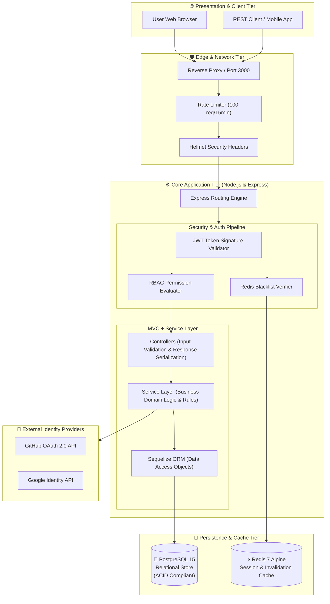
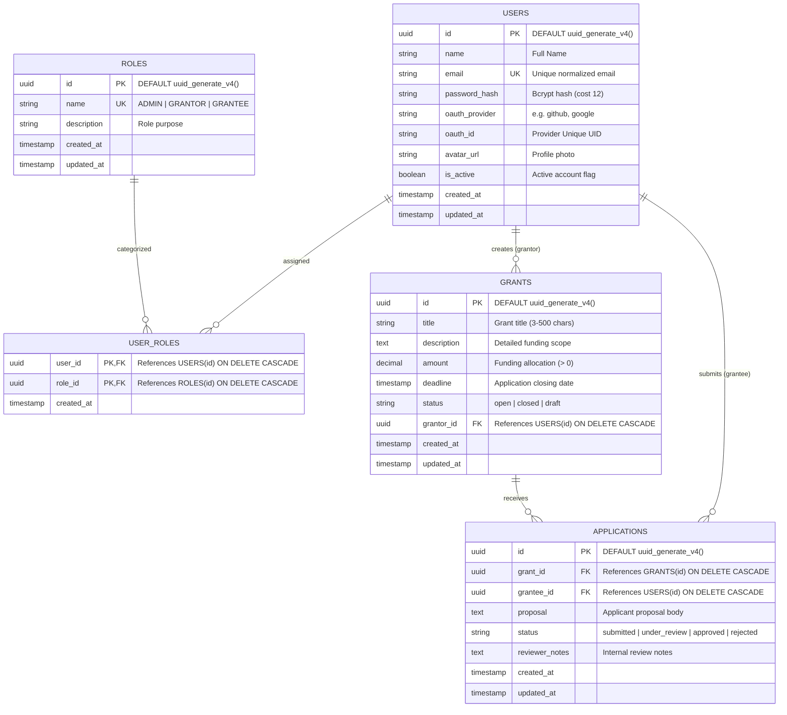
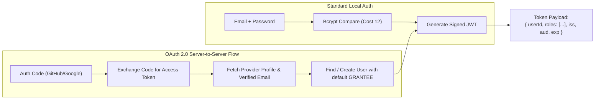
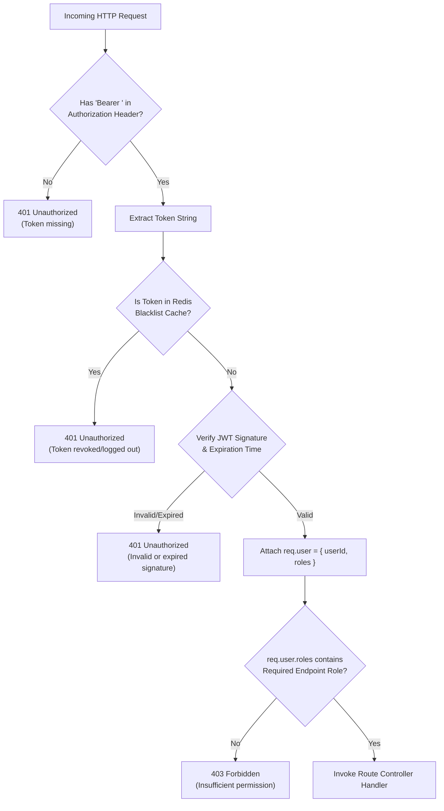
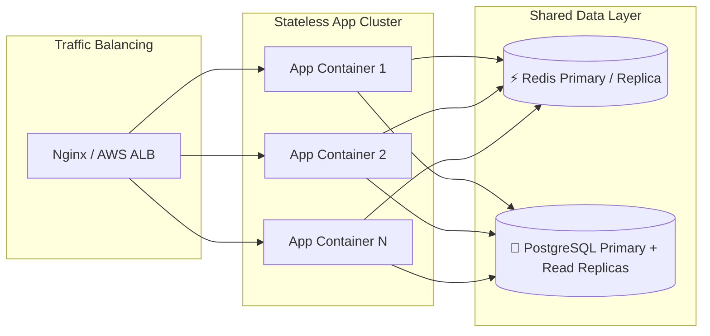

# 🏛️ System Architecture Specification
### Secure Grant Management Portal with RBAC & OAuth 2.0

---

## 1. Executive Summary & Objective

The **Secure Grant Management Portal** is an enterprise-tier web backend designed to govern the entire grant lifecycle—from funding opportunity announcement to application submission, review, and status determination. 

The primary architectural challenge is enforcing strict **Role-Based Access Control (RBAC)** across distinct personas (`ADMIN`, `GRANTOR`, `GRANTEE`) while supporting modern decentralized identity authentication via **OAuth 2.0** and maintaining a zero-trust, stateless token lifecycle backed by **Redis token revocation**.

---

## 2. High-Level Architecture

The system is organized around a multi-tier containerized topology orchestrating presentation, application logic, and storage services.

---

## 3. Database Entity-Relationship Diagram

The relational model implements strict foreign key constraints, cascading deletes on dependent relationships, and unique constraints to prevent duplicate applications or duplicate email registrations.

---

## 4. Security & Authentication Architecture

### 4.1. The Dual Authentication Strategy
The application accommodates two distinct entry modes:

### 4.2. RBAC Policy Enforcement Pipeline

---

## 5. Architectural Patterns & Decisions

### 5.1. Model-View-Controller (MVC) with Service Layer
To maintain clean code separation and prevent fat controllers:
1. **Controllers** ([`src/controllers`](file:///c:/Users/lokes/Desktop/Gpp-41/src/controllers)):
   - Parse HTTP requests, extract parameters/body, and handle response serialization.
   - Catch exceptions and pass them downstream to the centralized [`errorHandler`](file:///c:/Users/lokes/Desktop/Gpp-41/src/middleware/errorHandler.js).
2. **Services** ([`src/services`](file:///c:/Users/lokes/Desktop/Gpp-41/src/services)):
   - Encapsulate all business rules, authorization ownership checks (e.g., verifying that a grant being updated is owned by the requesting grantor), and external API calls.
3. **Models** ([`src/models`](file:///c:/Users/lokes/Desktop/Gpp-41/src/models)):
   - Define data schemas, constraints, field-level validations, and relational associations via Sequelize.

### 5.2. Caching & Session Invalidation with Redis
Traditional stateless JWTs suffer from the inability to be revoked prior to expiration. This architecture solves this via:
- **Token Blacklisting**: On `POST /api/auth/logout`, the JWT is stored in Redis with a TTL matching the token's remaining lifetime.
- **Fast In-Memory Lookup**: Middleware queries Redis in sub-millisecond time on every authenticated request.

---

## 6. Pros & Cons Analysis

### Advantages (Pros)
- **Zero-Trust Security**: No assumptions on user identity; JWT signature, Redis blacklist, and RBAC roles are validated at the route boundary.
- **True Stateless Horizontal Scalability**: Application instances are completely stateless and can scale behind load balancers; Redis handles shared token state.
- **Clean Domain Isolation**: Business rules in services remain completely independent of the Express HTTP transport layer, making testing straightforward.
- **Reproducible Container Ecosystem**: Multi-stage Docker build ensures development, testing, and production parity with minimal attack surface.

### Trade-offs (Cons)
- **Redis Dependency**: The authentication layer requires Redis connectivity for token blacklist checks. *(Mitigated by graceful fallback handling and connection retry strategies).*
- **Relational Overhead**: Many-to-many role joins require eager or lazy loading queries in Sequelize. *(Mitigated by proper indexing on `user_roles(user_id, role_id)`).*

---

## 7. Scalability & Fault Tolerance

