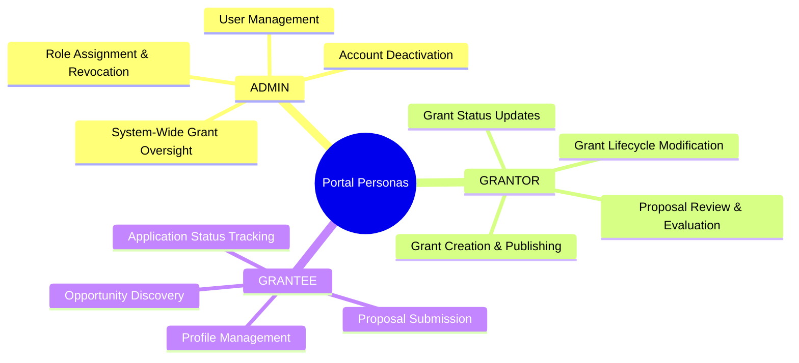
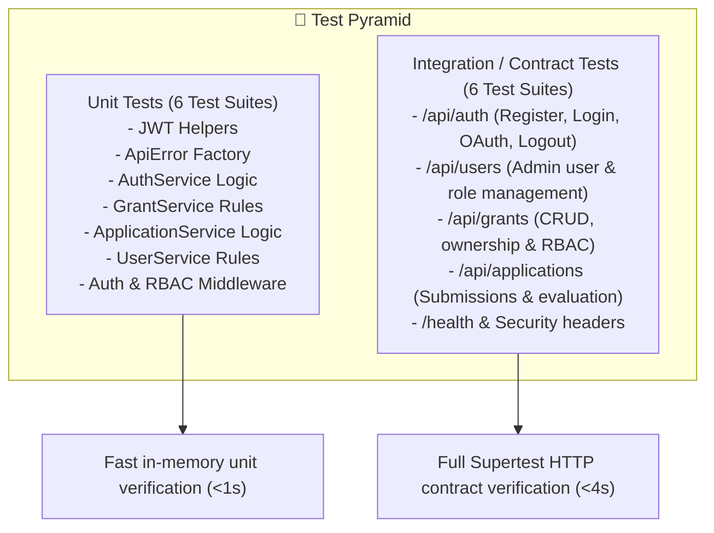

# 📖 Project Documentation
### Secure Grant Management Portal with RBAC & OAuth 2.0

---

## 1. Project Introduction & Functional Scope

The **Secure Grant Management Portal** provides a standardized backend platform for funding organizations to create grant opportunities, for applicants to discover and apply for grants, and for administrators to manage permissions and users.

### 1.1. Core Personas & Roles



---

## 2. Detailed Module Responsibilities

### 2.1. Authentication & Security Engine (`src/services/AuthService.js`)
- **Password Hashing**: Implements salted `bcryptjs` hashing with cost factor 12. Plaintext passwords are never logged or stored.
- **JWT Cryptographic Signing**: Issues tokens with HS256 algorithm including `userId`, `roles`, `issuer`, `audience`, and standard timestamp claims.
- **OAuth 2.0 Integration**: Implements Authorization Code Exchange for GitHub and Google APIs to fetch user profiles and auto-provision accounts with the default `GRANTEE` role.
- **Token Invalidation**: Interfaces with Redis to blacklist revoked tokens on logout.

### 2.2. User & Access Administration (`src/services/UserService.js`)
- **Role Assignment**: Provides atomic insertion into the `user_roles` join table for role delegation.
- **User Discovery**: Returns user directories with associated role arrays while excluding sensitive password hashes via Sequelize model scopes.
- **Account State Management**: Handles soft deactivation of accounts (`is_active: false`).

### 2.3. Grant Management Engine (`src/services/GrantService.js`)
- **Opportunity Lifecycle**: Manages `draft`, `open`, and `closed` grant statuses.
- **Ownership Verification**: Guarantees that only the `GRANTOR` who created a grant can edit its parameters or view submitted applications.
- **Administrative Override**: Permits system `ADMIN` users to delete outdated or inappropriate grant records.

### 2.4. Grant Application Engine (`src/services/ApplicationService.js`)
- **Proposal Intake**: Accepts and persists proposals while verifying that the target grant is currently in an `open` state.
- **Duplicate Prevention**: Enforces a database-level unique constraint (`grant_id`, `grantee_id`) to prevent duplicate submissions by the same grantee.
- **Status Evaluation**: Allows the grant-owning `GRANTOR` to review proposals and transition statuses across `submitted`, `under_review`, `approved`, and `rejected`.

---

## 3. Data Dictionary & Schema Specifications

### 3.1. Table: `roles`
| Column Name | Data Type | Constraints | Description |
|-------------|-----------|-------------|-------------|
| `id` | `UUID` | Primary Key, Default `uuid_generate_v4()` | Unique role identifier |
| `name` | `VARCHAR(50)` | Unique, Not Null, In (`ADMIN`, `GRANTOR`, `GRANTEE`) | Role key identifier |
| `description` | `TEXT` | Nullable | Human-readable role description |
| `created_at` | `TIMESTAMP WITH TIME ZONE` | Default `NOW()` | Timestamp of creation |
| `updated_at` | `TIMESTAMP WITH TIME ZONE` | Default `NOW()` | Timestamp of last update |

### 3.2. Table: `users`
| Column Name | Data Type | Constraints | Description |
|-------------|-----------|-------------|-------------|
| `id` | `UUID` | Primary Key, Default `uuid_generate_v4()` | Unique user identifier |
| `name` | `VARCHAR(255)` | Not Null | User full name |
| `email` | `VARCHAR(255)` | Unique, Not Null, Index | Normalized user email |
| `password_hash` | `VARCHAR(255)` | Nullable | Bcrypt hash (null for pure OAuth users) |
| `oauth_provider` | `VARCHAR(50)` | Nullable | OAuth provider name (e.g., `github`, `google`) |
| `oauth_id` | `VARCHAR(255)` | Nullable | Provider-specific unique subject ID |
| `avatar_url` | `VARCHAR(500)` | Nullable | Profile avatar URL |
| `is_active` | `BOOLEAN` | Default `TRUE` | Account active flag |
| `created_at` | `TIMESTAMP WITH TIME ZONE` | Default `NOW()` | Registration timestamp |
| `updated_at` | `TIMESTAMP WITH TIME ZONE` | Default `NOW()` | Last update timestamp |

### 3.3. Table: `user_roles`
| Column Name | Data Type | Constraints | Description |
|-------------|-----------|-------------|-------------|
| `user_id` | `UUID` | Foreign Key -> `users(id)` ON DELETE CASCADE | Pivot user ID |
| `role_id` | `UUID` | Foreign Key -> `roles(id)` ON DELETE CASCADE | Pivot role ID |
| `created_at` | `TIMESTAMP WITH TIME ZONE` | Default `NOW()` | Timestamp of assignment |

### 3.4. Table: `grants`
| Column Name | Data Type | Constraints | Description |
|-------------|-----------|-------------|-------------|
| `id` | `UUID` | Primary Key, Default `uuid_generate_v4()` | Unique grant identifier |
| `title` | `VARCHAR(500)` | Not Null, Length [3, 500] | Grant opportunity title |
| `description` | `TEXT` | Not Null | Full grant terms & proposal requirements |
| `amount` | `DECIMAL(15,2)` | Not Null, Check `amount > 0` | Available funding amount |
| `deadline` | `TIMESTAMP WITH TIME ZONE` | Nullable | Application closing deadline |
| `status` | `VARCHAR(50)` | Default `'open'`, In (`'open'`, `'closed'`, `'draft'`) | Current grant status |
| `grantor_id` | `UUID` | Foreign Key -> `users(id)` ON DELETE CASCADE, Index | Grant creator user ID |
| `created_at` | `TIMESTAMP WITH TIME ZONE` | Default `NOW()` | Grant posting timestamp |
| `updated_at` | `TIMESTAMP WITH TIME ZONE` | Default `NOW()` | Last modified timestamp |

### 3.5. Table: `applications`
| Column Name | Data Type | Constraints | Description |
|-------------|-----------|-------------|-------------|
| `id` | `UUID` | Primary Key, Default `uuid_generate_v4()` | Unique application identifier |
| `grant_id` | `UUID` | Foreign Key -> `grants(id)` ON DELETE CASCADE, Index | Parent grant ID |
| `grantee_id` | `UUID` | Foreign Key -> `users(id)` ON DELETE CASCADE, Index | Submitting user ID |
| `proposal` | `TEXT` | Not Null, Length [10, 50000] | Application proposal content |
| `status` | `VARCHAR(50)` | Default `'submitted'`, In (`'submitted'`, `'under_review'`, `'approved'`, `'rejected'`) | Review status |
| `reviewer_notes`| `TEXT` | Nullable | Internal notes from grantor |
| `created_at` | `TIMESTAMP WITH TIME ZONE` | Default `NOW()` | Submission timestamp |
| `updated_at` | `TIMESTAMP WITH TIME ZONE` | Default `NOW()` | Status update timestamp |

---

## 4. API Specification & Request/Response Contracts

### 4.1. `POST /api/auth/register`
Creates a new user account with local credentials.
- **Request Body**:
```json
{
  "name": "Sarah Connor",
  "email": "sarah@example.com",
  "password": "SecurePassword123!"
}
```
- **Response `201 Created`**:
```json
{
  "status": "success",
  "message": "User registered successfully.",
  "data": {
    "id": "c0000000-0000-4000-8000-000000000003",
    "name": "Sarah Connor",
    "email": "sarah@example.com",
    "created_at": "2026-10-04T08:00:00.000Z"
  }
}
```

### 4.2. `POST /api/auth/login`
Authenticates user credentials and returns a signed JWT.
- **Request Body**:
```json
{
  "email": "admin@grantportal.com",
  "password": "Admin@123456"
}
```
- **Response `200 OK`**:
```json
{
  "status": "success",
  "message": "Login successful.",
  "accessToken": "eyJhbGciOiJIUzI1NiIsInR5cCI6IkpXVCJ9...",
  "refreshToken": "eyJhbGciOiJIUzI1NiIsInR5cCI6IkpXVCJ9...",
  "user": {
    "id": "d0000000-0000-4000-8000-000000000004",
    "name": "System Administrator",
    "email": "admin@grantportal.com",
    "roles": ["ADMIN"]
  }
}
```

### 4.3. `POST /api/users/:userId/roles`
Assigns an RBAC role to a user (`ADMIN` only).
- **Headers**: `Authorization: Bearer <admin-jwt>`
- **Request Body**:
```json
{
  "roleName": "GRANTOR"
}
```
- **Response `200 OK`**:
```json
{
  "status": "success",
  "message": "Role 'GRANTOR' assigned successfully.",
  "data": {
    "id": "c0000000-0000-4000-8000-000000000003",
    "name": "Sarah Connor",
    "email": "sarah@example.com",
    "roles": [
      { "id": "role-uuid-1", "name": "GRANTEE" },
      { "id": "role-uuid-2", "name": "GRANTOR" }
    ]
  }
}
```

---

## 5. Comprehensive Error Handling Matrix

| HTTP Status | Error Type | Scenario | Response Structure |
|-------------|------------|----------|-------------------|
| **400 Bad Request** | Validation Failure | Invalid email format, missing required body field | `{"status": "error", "message": "Validation failed", "errors": [{"field": "email", "message": "A valid email is required"}]}` |
| **401 Unauthorized** | Missing/Invalid Token | Request missing `Authorization` header, expired JWT, or blacklisted token | `{"status": "error", "message": "Authentication required. Please provide a valid Bearer token."}` |
| **403 Forbidden** | RBAC Policy Violation | User with `GRANTEE` role attempting `POST /api/grants` | `{"status": "error", "message": "Access denied. Required roles: GRANTOR."}` |
| **404 Not Found** | Resource Missing | Non-existent grant ID requested | `{"status": "error", "message": "Grant not found."}` |
| **409 Conflict** | Uniqueness Violation | Duplicate user registration or duplicate grant application | `{"status": "error", "message": "You have already submitted an application for this grant."}` |
| **500 Internal Error**| Unexpected Exception | Unhandled runtime exception or database connectivity loss | `{"status": "error", "message": "Internal server error"}` |

---

## 6. Testing Strategy & Execution

### 6.1. Testing Architecture



### 6.2. Executing the Test Suite

```bash
# Run unit & integration test suites
npm test

# Generate full Istanbul code coverage report
npm run test:coverage
```

The test runner will produce reports formatted as terminal output and HTML files in `coverage/lcov-report/index.html`.

---

## 7. Operational Deployment & Health Monitoring

### 7.1. Health Check Endpoint
- **URL**: `GET /health`
- **Output**:
```json
{
  "status": "ok",
  "service": "grant-portal-api",
  "timestamp": "2026-10-04T08:30:00.000Z",
  "uptime": 124.5,
  "environment": "production"
}
```

### 7.2. Docker Health Checks
Docker Compose monitors all three services continuously:
- **`app`**: Probes `GET /health` every 30 seconds.
- **`db`**: Executes `pg_isready -U postgres -d grantportal` every 10 seconds.
- **`cache`**: Sends `redis-cli ping` every 10 seconds.
